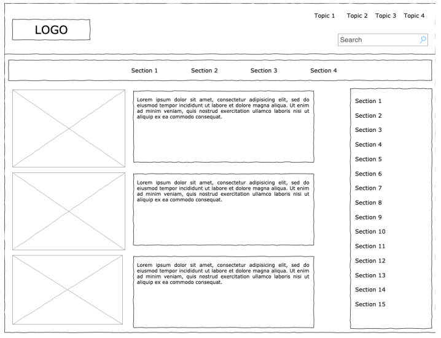

# Exercício 01

## Disciplina frameworks front-end com React

### PUC MINAS

## Instuções

o aluno deverá desenvolver um rascunho da aplicação conforme descrita abaixo, utilizando pelo menos 4 componentes:

- Cabeçalho
- Menu de navegação
- Artigo
- Sidebar

